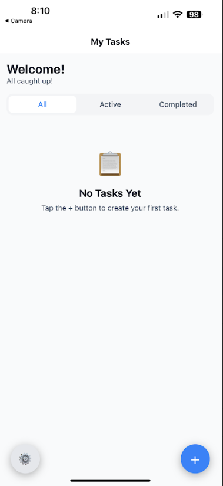
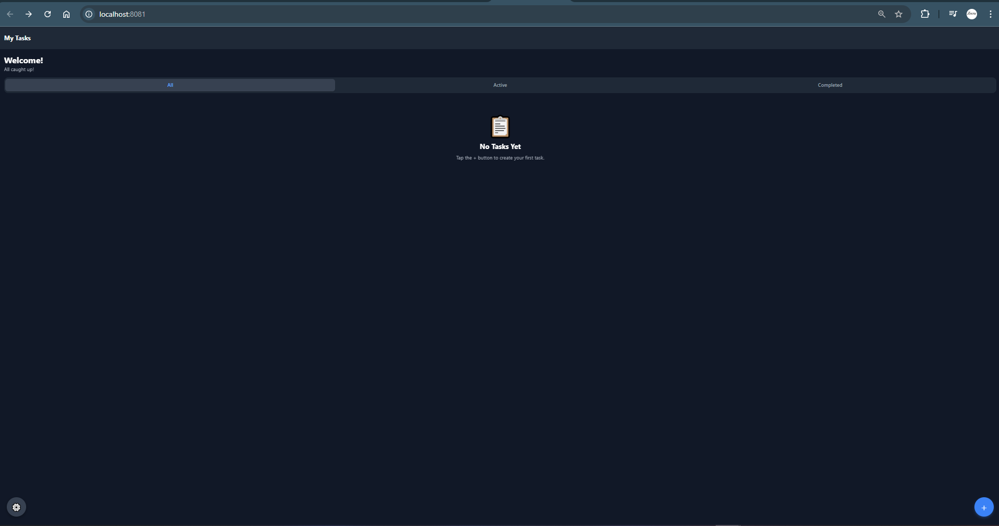
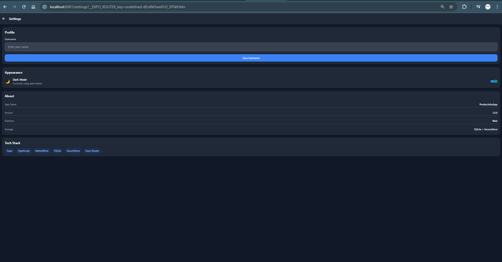

# ProductivityApp

A cross-platform productivity application built with Expo, TypeScript, and NativeWind. This app helps users manage their tasks with priority levels, completion tracking, and persistent storage.

## 📱 Features Overview

### Core Features
- **Task Creation** - Create tasks with title, description, and priority level (High, Medium, Low)
- **Priority Colors** - Visual color indicators for task priorities (Red=High, Amber=Medium, Green=Low)
- **Completion Toggle** - Mark tasks as complete/incomplete with a single tap
- **Task Deletion** - Delete tasks with confirmation dialog
- **Task Filtering** - Filter tasks by All, Active, or Completed status
- **Task Statistics** - View total, completed, and active task counts with progress bar

### Data Persistence
- **SQLite Database** - All tasks are stored locally using expo-sqlite
- **SecureStore** - User settings (username, theme) stored securely using expo-secure-store
- **Error Handling** - Comprehensive try/catch error handling around all database operations

### Enhanced Feature: Dark Mode
- **Theme Context** - Global theme management using React Context
- **Persistent Theme** - Theme preference saved to SecureStore
- **Full Coverage** - Dark mode applies to all screens, headers, backgrounds, text, buttons, and lists
- **Toggle Switch** - Easy theme switching in Settings screen

## 🚀 Project Setup Instructions

### Prerequisites
- Node.js (v18 or later recommended)
- npm or yarn
- Expo CLI (`npm install -g expo-cli`)
- Expo Go app on your mobile device (for testing)

### Installation

1. **Clone or navigate to the project directory**
   ```bash
   cd ProductivityApp
   ```

2. **Install dependencies**
   ```bash
   npm install
   ```

3. **Start the development server**
   ```bash
   npx expo start
   ```

### Running on Different Platforms

#### iOS/Android (Expo Go)
1. Start the development server: `npx expo start`
2. Scan the QR code with:
   - **iOS**: Camera app or Expo Go app
   - **Android**: Expo Go app
3. The app will load on your device

#### Web Browser
```bash
npx expo start --web
```
Or press `w` after starting the dev server.

#### iOS Simulator (macOS only)
```bash
npx expo start --ios
```
Or press `i` after starting the dev server.

#### Android Emulator
```bash
npx expo start --android
```
Or press `a` after starting the dev server.

### Testing the App

1. **Create Tasks**: Tap the `+` button to add new tasks
2. **Set Priority**: Choose High, Medium, or Low priority
3. **Complete Tasks**: Tap on a task to toggle completion
4. **Delete Tasks**: Tap the `✕` button and confirm deletion
5. **Filter Tasks**: Use the filter tabs (All/Active/Completed)
6. **Settings**: Tap the `⚙️` button to access settings
7. **Dark Mode**: Toggle dark mode in Settings
8. **Username**: Set your username in Settings

## 📂 Project Structure

```
ProductivityApp/
├── app/
│   ├── _layout.tsx      # Root layout with theme & DB bootstrapping
│   ├── index.tsx        # Home screen - Task list
│   ├── add-task.tsx     # Add new task screen
│   └── settings.tsx     # User settings screen
├── components/
│   ├── TaskItem.tsx     # Individual task component
│   ├── TaskStats.tsx    # Statistics display component
│   ├── FilterTabs.tsx   # Filter tabs component
│   ├── PrioritySelector.tsx # Priority selection component
│   ├── EmptyState.tsx   # Empty state display
│   └── index.ts         # Component exports
├── services/
│   ├── db.ts            # SQLite database service
│   └── settings.ts      # SecureStore settings service
├── contexts/
│   └── ThemeContext.tsx # Theme context provider
├── constants/
│   └── index.ts         # App constants
├── types/
│   └── index.ts         # TypeScript type definitions
├── assets/              # App icons and images
├── screenshots/         # App screenshots
├── global.css           # Global Tailwind styles
├── tailwind.config.js   # Tailwind configuration
├── app.json             # Expo configuration
├── package.json         # Dependencies
├── tsconfig.json        # TypeScript configuration
├── README.md            # This file
└── REFLECTION.md        # Development reflection
```

## 📱 Screens Summary

### 1. Home Screen (`index.tsx`)
- Displays personalized greeting with username
- Shows task statistics (total, completed, active)
- Filter tabs for All/Active/Completed tasks
- Task list with priority color indicators
- Floating action button (+) to add tasks
- Settings button (⚙️) for quick access

### 2. Add Task Screen (`add-task.tsx`)
- Title input field (required)
- Description input field (optional)
- Priority selector (High/Medium/Low)
- Cancel and Create buttons
- Form validation with error alerts

### 3. Settings Screen (`settings.tsx`)
- Username input with save functionality
- Dark/Light mode toggle switch
- App information section
- Tech stack display

## 🛠 Tech Stack

| Technology | Purpose |
|------------|---------|
| Expo SDK 52 | Cross-platform framework |
| TypeScript | Type-safe development |
| NativeWind v4 | Tailwind CSS for React Native |
| expo-sqlite | Local SQLite database |
| expo-secure-store | Secure settings storage |
| Expo Router | File-based navigation |
| React Native | UI components |

## 📸 Screenshots

| Screen | Mobile | Web |
|--------|--------|-----|
| Home Screen |  |  |
| Add Task |  |  |
| Settings |  |  |

## ⚠️ Known Issues

1. **Web SQLite**: On web, expo-sqlite uses an in-memory database that resets on page refresh. For production web apps, consider using IndexedDB or a backend API.

2. **SecureStore Web Fallback**: SecureStore is not available on web, so localStorage is used as a fallback. This is less secure but functional for development.

## 📝 Submission Notes

- ✅ Compatible with Expo Go (iOS and Android)
- ✅ Works on mobile devices
- ✅ Works on web browsers
- ✅ Responsive layout on all screen sizes
- ✅ Same features available on mobile + web
- ✅ Dark mode fully implemented
- ✅ SQLite persistence for tasks
- ✅ SecureStore for user settings
- ✅ TypeScript throughout
- ✅ NativeWind styling

## 🔄 Git Commit History

```
feat: add SQLite task creation and initial database structure
feat: implement task list with priority colors and filtering
feat: add Expo Router navigation and screen layout
feat: integrate SecureStore for theme + username settings
feat: implement dark mode with context and persistent storage
style: apply NativeWind styling across screens
docs: add README.md with setup instructions and screenshots template
refactor: clean up database service and error handling
chore: project cleanup and submission prep
```

## 📄 License

This project was created as a student assignment for learning purposes.
